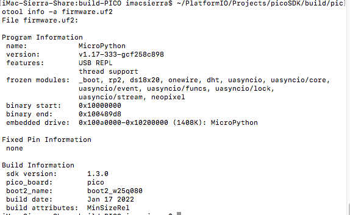

# RP2040-micropython-build
How to build rp2040 micropython on MacOS

Following are steps to build the micropython.uf2...   

  git clone https://www.github.com/micropython/micropython 
  cd micropython/ 
  make -C mpy-cross/ 
  git submodule update --init -- lib/pico-sdk 
  git submodule update --init -- lib/tinyusb 
  cd lib/pico-sdk 
  git submodule update --init 
  cd ../.. 
  cd ports/rp2 
  make -j4 
  cd build-PICO
    
  
Finally, find the picotool in SDK and list the info...   

 

##Reference  
[RP2 QuickRef]https://docs.micropython.org/en/latest/rp2/quickref.html 
[Pico Examples]https://github.com/raspberrypi/pico-micropython-examples 
