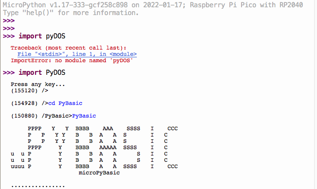

# RP2040-micropython-build
How to build rp2040 micropython on MacOS

Followings are the steps to build the micropython.uf2...   

  git clone https://www.github.com/micropython/micropython 
  cd micropython/ 
  make -C mpy-cross/ 
  git submodule update --init -- lib/pico-sdk 
  git submodule update --init -- lib/tinyusb 

  cd ../.. 
  cd ports/rp2 
  make -j4 
  cd build-PICO
    
  
Finally, find the picotool in SDK and list the info...   

 

To use the PyDOS, follows instructions on https://github.com/RetiredWizard/PyDOS  
(use MPRemote to copy PyDOS contents into micropython local folder) 

 

## Reference  
[RP2 QuickRef] https://docs.micropython.org/en/latest/rp2/quickref.html 
[Pico Examples] https://github.com/raspberrypi/pico-micropython-examples 
[Awesome resources collections] https://github.com/mcauser/awesome-micropython 
[PyDOS] https://github.com/RetiredWizard/PyDOS
